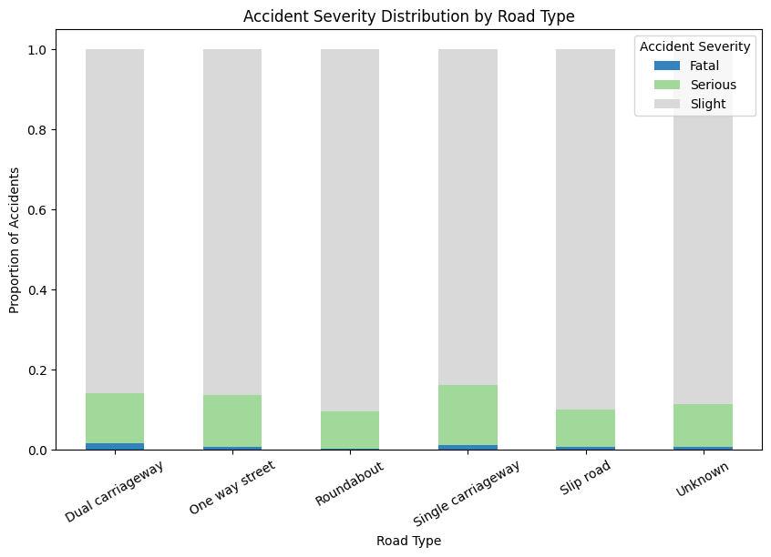
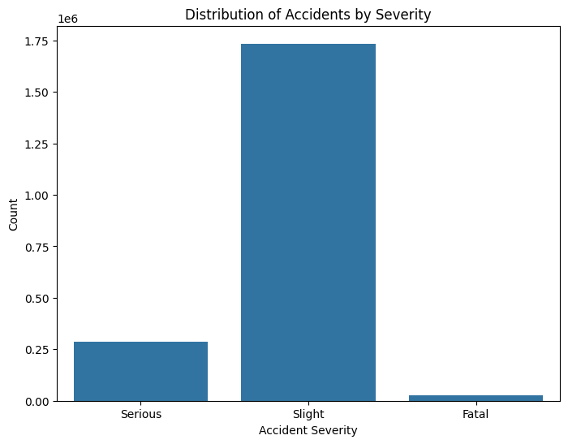
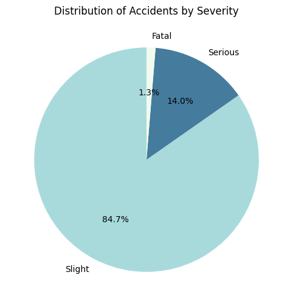
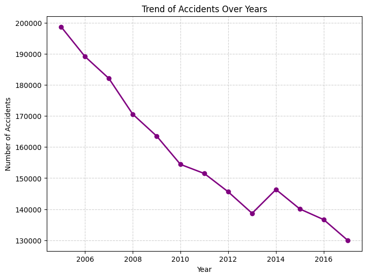
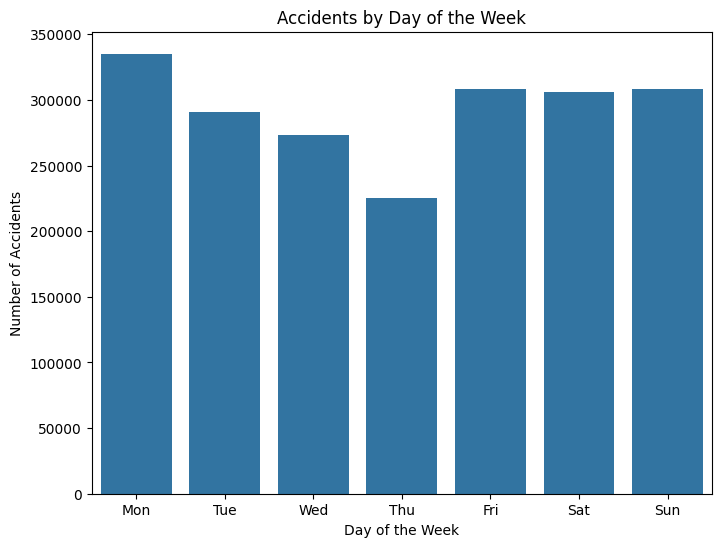
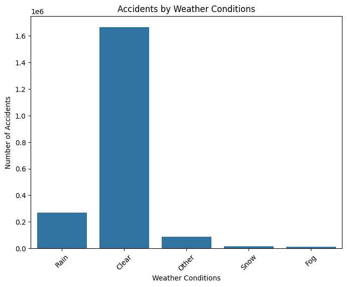
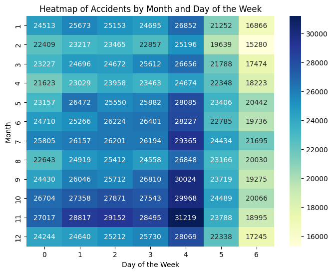
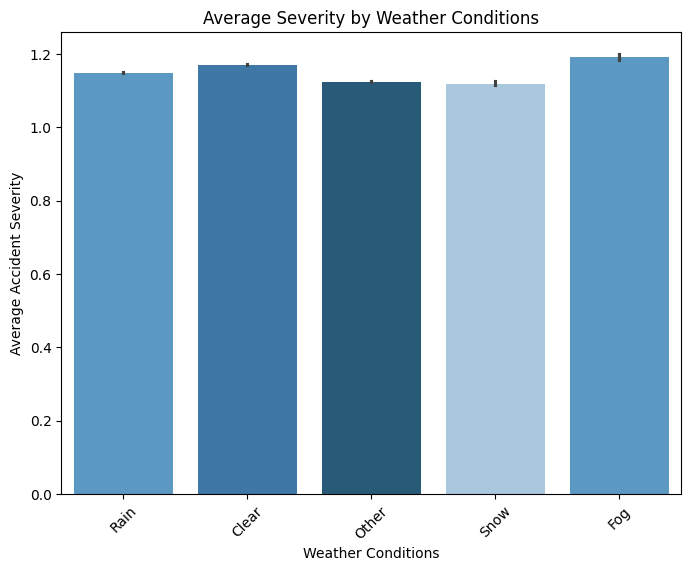
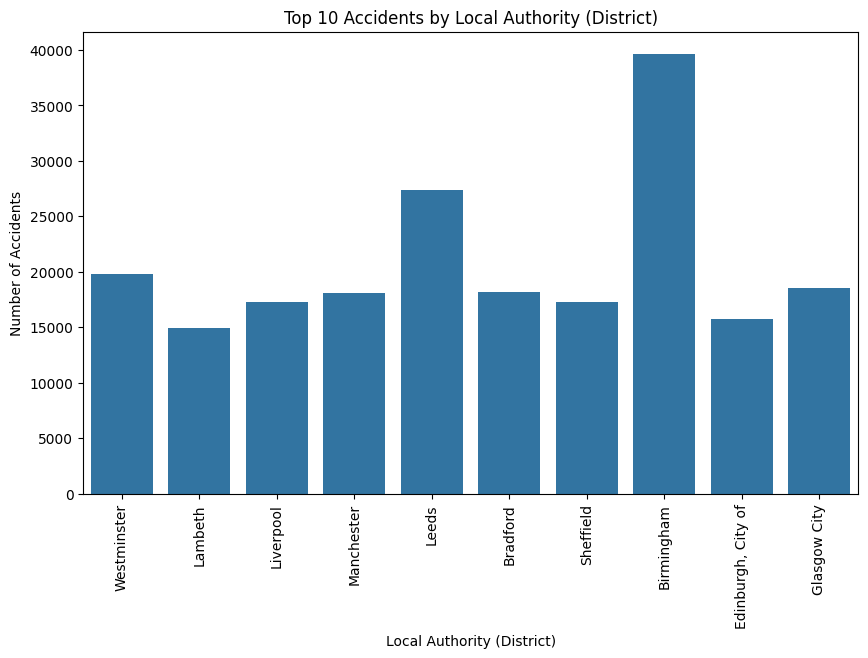

# Traffic Accident Analysis 🚦

## 📊 Overview
This project analyzes traffic accident data to identify patterns, risk factors, and trends affecting road safety.

## 🛠️ Tools
- Python (Pandas, NumPy)
- Matplotlib, Seaborn
- Google Colab

## 🔍 Steps
- Data Cleaning  
- Exploratory Data Analysis (EDA)  
- Data Visualization  

## 📈 Key Insights
- Certain times of day have higher accident rates  
- Weather conditions influence accident frequency  
- Some locations show consistently higher accident occurrence  
- Accident severity varies based on road and environmental factors  

## 🚀 How to Run
- Open the notebook in Google Colab  
- Upload dataset  
- Run all cells

- ## 📊 Results

### 🚗 Accident Severity by Road Type

### 📊 Accident Severity Count

### 🧩 Accident Severity Distribution

### 📈 Accident Trend Over Years

### 📅 Accidents by Day of Week

### 🌦️ Accidents by Weather Conditions

### 🔥 Accidents Heatmap (Month vs Day)

### 🌫️ Average Severity by Weather

### 🏙️ Top 10 Districts by Accidents

